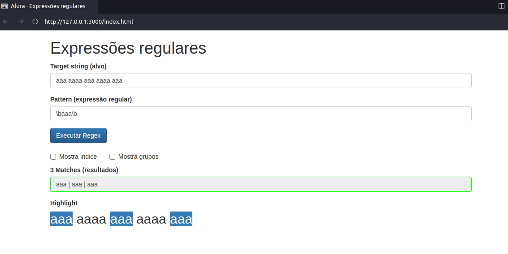

## Curso de Expressões regulares: capturando textos de forma mágica |ALURA

Faça esse curso de JavaScript e:

 - Entenda o que são expressões regulares
 - Valide formulários HTML
 - Aprenda a identificar CPF, CEP, emails e outros documentos
 - Crie expressões regulares eficientes
 - Use classes, âncoras, quantifiers e grupos
 - Execute expressões regulares na sua linguagem

**GitHub Pages** 
[Acessem](https://tiagomerc.github.io/Express-es-regulares-capturando-textos-de-forma-m-gica-ALURA/)

### 01. Começando com Regex

Pesquisando CPF | Expressão regular
\d\d\d\.\d\d\d\.\d\d\d-\d\d

quantifer

\d{3}\.\d{3}\.\d{3}-\d{2}

O que aprendemos?

- Regex, ou expressões regulares, é uma linguagem para encontrar padrões de texto.

- Sendo uma linguagem independente, existem interpretadores para a maioria das plataformas de desenvolvimento, como JavaScript, C#, Python ou Ruby.

- Uma classe de caracteres predefinida é **\d**, que significa qualquer dígito.

- Existem vários meta-char, como **.** ou *****.

- Existem quantifiers que definem quantas vezes um caractere deve aparecer:
  - {1} é um quantifier que significa uma vez.
  - * é um quantifier que significa zero, uma ou mais vezes

- . é um meta-char que significa qualquer char.

- Com \ podemos escapar meta-chars, por exemplo \..

**Encontrando o CEP**

### 02. Classes de caracteres 

Para capturas onde não tem nehnum ponto ou traço separando os digitos.
Ex.: 98765432100

\d{3}\.?\d{3}\.?\d{3}-?\d{2}

Classes de caracteres são entre colchetes []

\d{3}\.?\d{3}\.?\d{3}[-.]?\d{2}

\d{3}[-.]?\d{3}[-.]?\d{3}[-.]?\d{2}

Outro exemplo:

No <code>for</code>, o valor de <code>i</code> começa de zero e é incrementado a cada volta enquanto <code>i < 10</code>, portando o bloco de código do for é executado 10 vezes. 

[</]?code>

Repare que usamos o meta-char ? para sinalizar que o / é opcional.

**Praticando classes e quantifier**

[1-3]?\d\s{1,}

O que aprendemos?

- Podemos definir facilmente a classe de qualquer caractere com o **[A-Z]**.

- Conhecemos todos os quantifiers como **?**, **+**, * e **{n}**.

- **\s** significa whitespace e é um atalho para **[ \t\r\n\f]**.

- **\w** significa word char e é uma atalho para **[A-Za-z0-9_]**.

## 03. Encontrando a posição certa com âncoras 

**\b - Word boundary** 

**Âncoras de Início e fim**

O que aprendemos?

- Existem âncoras predefinidas que selecionam uma posição dentro do alvo.

- **\b** é uma âncora que seleciona um word boundary, isso é o início ou fim da palavra.

- **^** é uma âncora que seleciona o início da string alvo.

- **$** é uma âncora que seleciona o fim do alvo.